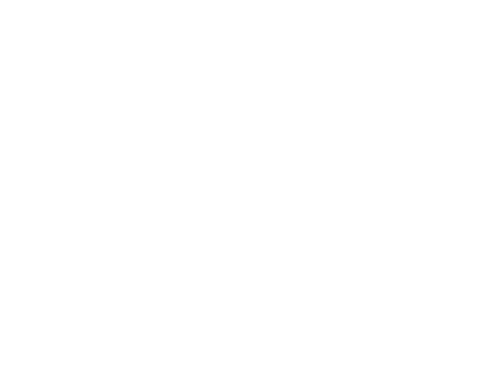

# 🛍️ Mall Customer Segmentation using K-Means

## 📌 Project Overview

This project applies the **K-Means Clustering** algorithm to segment mall customers based on their **Annual Income** and **Spending Score**.

Customer segmentation helps businesses understand customer behavior and create personalized marketing strategies for different customer groups.

---

## 🎯 Objectives

- Explore customer data.
- Perform Exploratory Data Analysis (EDA).
- Visualize customer distribution.
- Determine the optimal number of clusters using the Elbow Method.
- Apply the K-Means algorithm.
- Analyze customer segments and provide business recommendations.

---

## 📂 Dataset

**Dataset:** Mall Customers Dataset

Features:

- CustomerID
- Gender
- Age
- Annual Income (k$)
- Spending Score (1-100)

Number of customers: **200**

---

## 🛠️ Technologies Used

- Python
- Pandas
- NumPy
- Matplotlib
- Scikit-learn
- Jupyter Notebook

---

## 📊 Project Workflow

1. Data Loading
2. Data Exploration (EDA)
3. Data Cleaning
4. Data Visualization
5. Elbow Method
6. K-Means Clustering
7. Cluster Visualization
8. Business Insights

---

## 📈 Results

- The Elbow Method identified **K = 5** as the optimal number of clusters.
- Customers were successfully divided into five meaningful groups.
- Each cluster represents customers with different purchasing behaviors.

---

## 💼 Business Insights

- High Income & High Spending customers are ideal candidates for VIP programs.
- High Income & Low Spending customers should receive personalized promotions.
- Low Income & High Spending customers can be targeted with affordable offers and loyalty programs.
- Medium customers can be encouraged through seasonal campaigns.

---

## 📁 Project Structure

```
kmeans-customer-segmentation/
│
├── data/
│   └── Mall_Customers.csv
│
├── notebooks/
│   └── KMeans_Customer_Segmentation.ipynb
│
├── images/
│   └── customer_clusters.png
│
├── README.md
├── requirements.txt
└── .gitignore
```

---

## 🚀 How to Run

```bash
git clone https://github.com/roudagaballah/kmeans-customer-segmentation.git

cd kmeans-customer-segmentation

pip install -r requirements.txt

jupyter notebook
```

---

## 📷 Project Output

> Add the generated customer clustering image here.

```markdown

```

---

## 👩‍💻 Author

**Rawda Gaballah**

Aspiring Machine Learning Engineer